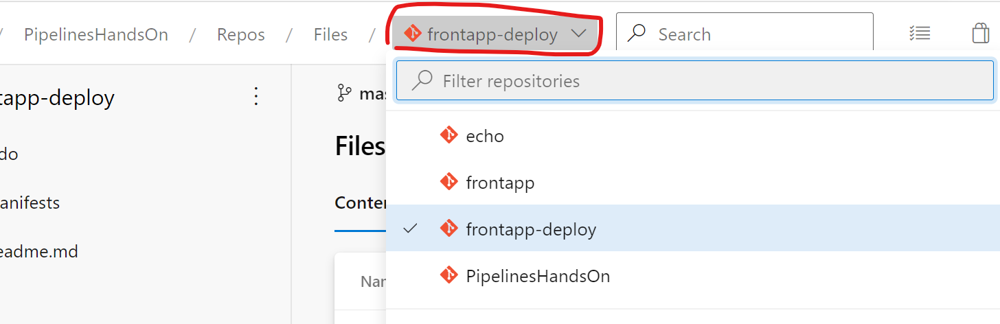
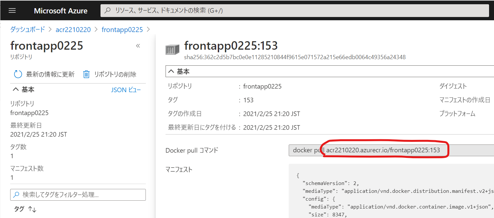
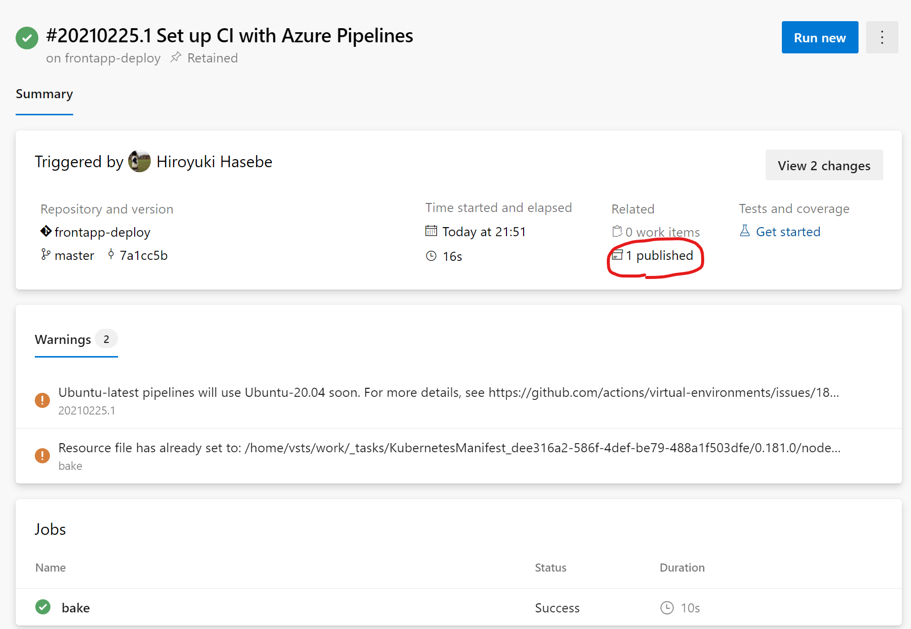

# Lab 3 - AKS へのデプロイ

このラボでは Azure Pipelines を使用して AKS にアプリケーションをデプロイします。このラボを実施する前に [Lab 2](https://github.com/hiroyha1/frontapp) を完了してください。

## リポジトリの取得

1. ブラウザを起動し、Azure DevOps の対象のプロジェクトを開きます。
2. Repos の Files を開きます。
3. 画面上部のプロジェクト名が表示されたドロップダウンをクリックし、"Import Repository" を選択します。
4. Clone URL 欄に "https://github.com/hiroyha1/frontapp-deploy" と入力し、"Import" をクリックします。

## Environment の作成

1. Pipelines の Environments を開きます。
2. "Create environment" (既に Environment が存在する場合は "New environment") をクリックします。
3. Name 欄に production と入力し、"Kubernetes" にチェックを入れて "Next" をクリックします。
4. "New environment" と表示される画面でデプロイ先の AKS リソースを選択します。リソースが見つからない場合やエラーが発生する場合は、対象の AKS リソースに対して現在のユーザーがクラスター管理者ロールの役割を持っているか確認してください。
5. Namespace 欄では "New" にチェックを入れ、任意の名前空間名を入力します。ここで入力した名前空間が AKS 内に作成されます。

## Variable group の作成

次の変数を持つ "aks-variable-group" という名前の Variable group を作成します。

| 名前 | 値 |
|--|--|
| resource_name | Environment の作成時に指定した名前空間名 |

## deployment.yaml の編集

レポジトリ内の deployment.yaml はサンプルのイメージ名が記載されているため、実際のイメージ名に変更します。

1. Repos の Files を開きます。
2. 現在のリポジトリが frontapp-deploy になっていない場合は、画面上部のプルダウン メニューから frontapp-deploy を選択します。

3. `manifests/base/deployment.yaml` を開きます。
4. 16 行目のコンテナ イメージを Lab 2 で確認した、Azure Container Registry にプッシュされたイメージ名に変更します。


変更前:
```yaml
    spec:
      containers:
      - image: acr2210220.azurecr.io/frontapp:102
```

変更後(例):
```yaml
    spec:
      containers:
      - image: myacr.azurecr.io/frontapp0225:153
```

## パイプラインの作成 - その 1

ここでは [Kustomize](https://kustomize.io/) を使用してプロダクション環境用のマニフェスト ファイルを生成します。

1. これまでのラボを同様に frontapp-deploy リポジトリに対して "Starter pipeline" テンプレートの YAML ファイルを作成します。
2. azure-pipelines.yml の内容を次のように書き換えます。
```yaml
trigger:
- master

variables: 
- group: acr-variable-group
- group: aks-variable-group

stages:
- stage: deploy
  displayName: Deploy to production
  jobs:
  - job: bake
    pool:
      vmImage: ubuntu-latest
    steps:
    - task: KubernetesManifest@0
      name: bake
      inputs:
        action: 'bake'
        renderType: 'kustomize'
        kustomizationPath: 'manifests/overlays/production'
    - publish: '$(bake.manifestsBundle)'
      artifact: manifests
```
3. "Save and run" をクリックすると YAML ファイルが保存され、パイプラインが実行されます。
4. ビルドに成功すると、生成されたマニフェストがパイプラインのアーティファクトに登録されます。ファイルは "1 published" と書かれたところをクリックすると確認することができます。


## 解説 - ラボで作成したパイプラインについて

```yaml
variables: 
- group: acr-variable-group
- group: aks-variable-group
```

2 つの Variable group を参照していますが、これらが定義する変数はラボの後半で使用します。

```yaml
stages:
- stage: deploy
  displayName: Deploy to production
  jobs:
  - job: bake
    pool:
      vmImage: ubuntu-latest
```

これまではステージ、ジョブを省略していましたが、ここでは明示的にステージとジョブを記述しています。

```yaml
    steps:
    - task: KubernetesManifest@0
      name: bake
      inputs:
        action: 'bake'
        renderType: 'kustomize'
        kustomizationPath: 'manifests/overlays/production'
```

[Kubernetes manifest](https://docs.microsoft.com/en-us/azure/devops/pipelines/tasks/deploy/kubernetes-manifest?view=azure-devops) というタスクを実行しています。

このタスクでは様々な Kubernetes のマニフェストに関する処理を行うことができますが、ここでは Kustomize によってマニフェストを生成する `bake` アクションを実行しています。

このタスクが実行されると `<タスク名>.manifestsBundle` (ここでは `bake.manifestsBundle`) という名前の変数に生成されたマニフェスト ファイルのパスが格納されます。


```yaml
    - publish: '$(bake.manifestsBundle)'
      artifact: manifests
```

[Publish Pipeline Artifacts](https://docs.microsoft.com/en-us/azure/devops/pipelines/tasks/utility/publish-pipeline-artifact?view=azure-devops) というタスクを実行しています。`- publish:` という表記は `- task: PublishPipelineArtifact@1` の省略形です。

このタスクが実行されると、前のタスクで生成されたマニフェスト ファイル (パス `$(bake.manifestsBundle)` で指定されたファイル) を `manifests` という名前の Pipeline artifacts として公開します。

Pipeline artifacts は Azure Artifacts とは別もので、パイプライン内のステージ間や異なるパイプライン間などでファイルを共有する目的で使用することができます。

## パイプライン作成 - その 2

1. Pipelines を開きます。
2. "パイプライン作成 - その 1" で作成したパイプライン "frontapp-deploy" をクリックします。
3. "Edit" をクリックします。
4. 元の YAML の内容に続けて、以下の内容を記述します。
```yaml
  - deployment: deploy
    dependsOn: bake
    pool:
      vmImage: ubuntu-latest
    environment: production.$(resource_name)
    strategy:
      runOnce:
        deploy:
          steps:
          - task: KubernetesManifest@0
            inputs:
              action: 'createSecret'
              namespace: $(resource_name)
              secretType: 'dockerRegistry'
              secretName: 'regcred'
              dockerRegistryEndpoint: $(acr_connection_name)
          - task: KubernetesManifest@0
            inputs:
              action: 'deploy'
              namespace: $(resource_name)
              manifests: '$(Pipeline.Workspace)/manifests/*.yaml'
```
5. "Save" をクリックするとビルドが開始されます。("Run" をクリックしなくても、master ブランチへ azure-pipelines.yml がコミットされたことをトリガーにビルドが開始されます)

## 解説 - ラボで作成したパイプラインについて

```yaml
  - deployment: deploy
    dependsOn: bake
    pool:
      vmImage: ubuntu-latest
    environment: production.$(resource_name)
    strategy:
      runOnce:
        deploy:
          steps:
          - task: KubernetesManifest@0
            inputs:
              action: 'createSecret'
              namespace: $(resource_name)
              secretType: 'dockerRegistry'
              secretName: 'regcred'
              dockerRegistryEndpoint: $(acr_connection_name)
          - task: KubernetesManifest@0
            inputs:
              action: 'deploy'
              namespace: $(resource_name)
              manifests: '$(Pipeline.Workspace)/manifests/*.yaml'
```